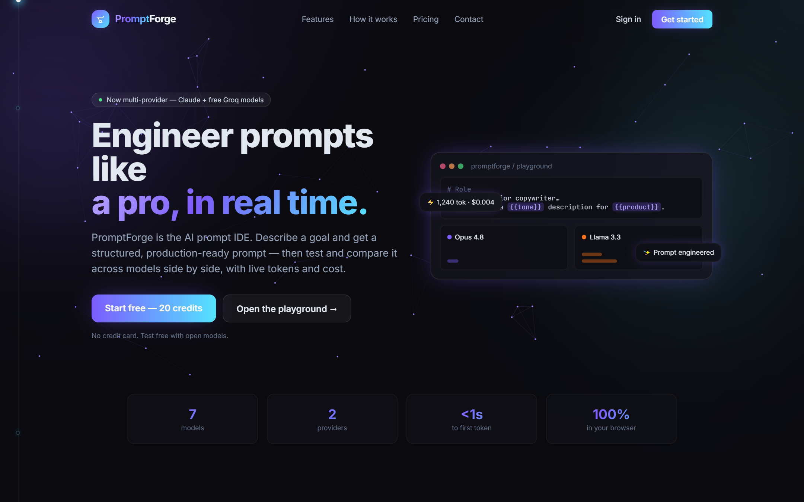
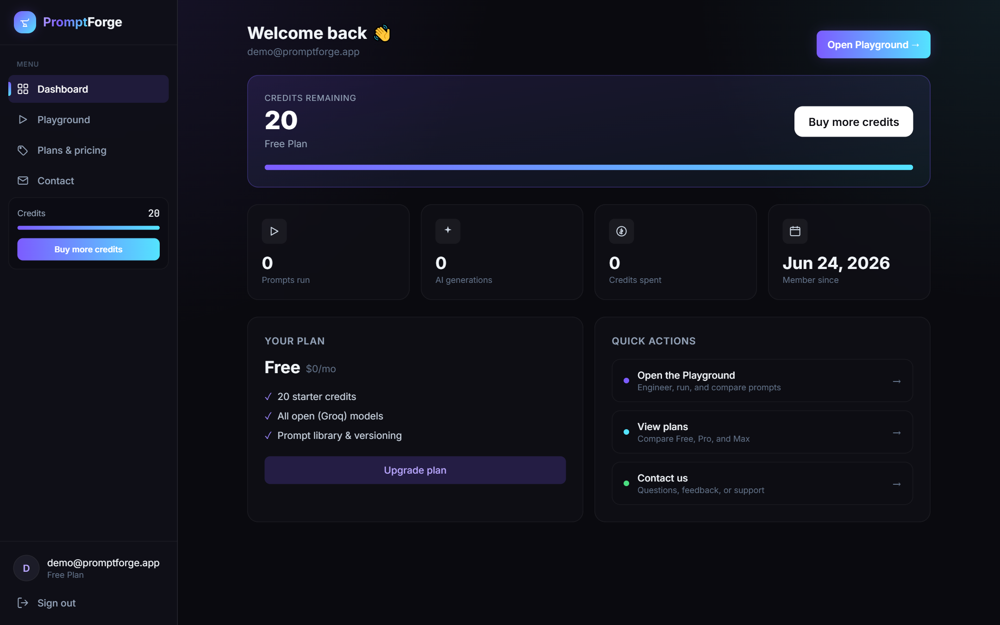

<div align="center">

# ⚒️ PromptForge

### The AI Prompt IDE — engineer, test, and compare prompts in real time

Describe a goal in plain English and get a **structured, production-ready prompt**, then **stream and compare it across multiple AI models side by side** — with live token counts, cost, accounts, credits, and plans.

<!-- Add your live link + a GIF once deployed -->
<!-- [**▶ Live demo**](https://your-deploy-url.vercel.app) -->


</div>

---

## 📸 Screenshots

**Landing page** — animated hero with an interactive neural canvas that reacts to the cursor.



**Dashboard** — credits, usage stats, and plans, with a left-nav sidebar.



---

## ✨ Why this exists

Every developer building with LLMs hits the same wall: *"Is my prompt actually good, and which model should I run it on?"* Today that means juggling a chat window, a tokenizer tab, and a pricing page. **PromptForge is the workbench that replaces all three** — and adds an AI prompt engineer that writes the prompt for you.

## 🚀 Features

- **✨ AI Prompt Engineer** — describe your goal in a sentence; get a structured prompt with **Role / Task / Context / Requirements / Constraints / Output format** sections, auto-detected `{{variables}}`, and an explanation of what was engineered.
- **🆚 Side-by-side model diffing** — run one prompt across multiple models at once and read outputs, tokens, latency, and cost side by side.
- **🔌 Multi-provider** — **Claude** (Opus 4.8, Sonnet 4.6, Haiku 4.5, Fable 5) via the Anthropic API, and free **Groq** open models (Llama 3.3 / 3.1, Gemma 2) via an OpenAI-compatible API. Use either or both.
- **⚡ Real-time streaming** — responses stream token-by-token over Server-Sent Events.
- **🔢 Live token & cost estimator** — instant input estimate before you run; exact usage and real cost per model after.
- **🧩 Variables & templates** — turn any prompt into a reusable template with smart example suggestions.
- **📚 Prompt library with versioning** — save prompts and keep a version history.
- **👤 Accounts, credits & plans** — email/password auth (hashed, signed httpOnly sessions), **server-enforced credit metering** on every run/generation, and Free / Pro / Max plans with a simulated checkout.
- **📊 Dashboard** — animated Growth-style stats (prompts run, generations, credits spent), a left-nav sidebar, and account management.
- **🎨 Polished, animated UI** — landing page with an **interactive neural canvas** that reacts to the cursor, a **scroll-drawn thread** connecting sections, page transitions, toasts, and count-up numbers — all respecting `prefers-reduced-motion`.

## 🧱 Tech stack

| Layer | Choice |
| --- | --- |
| Framework | **Next.js 15** (App Router) + **React 19** |
| Language | **TypeScript** |
| Styling | **Tailwind CSS** + custom design tokens (Inter + JetBrains Mono) |
| Animation | **Framer Motion** + Canvas |
| State | **Zustand** (with `persist`) |
| AI | **Anthropic API** (`@anthropic-ai/sdk`, streaming + structured outputs) and **Groq** (OpenAI-compatible) |
| Auth & data | Self-contained (Node `crypto`, file-backed store) — swappable for a real DB |

## 🏁 Quick start

> Requires **Node.js 18.18+**. At least one provider key (Groq is free).

```bash
# 1. Install
npm install

# 2. Configure env
cp .env.local.example .env.local
#   then edit .env.local:
#   - GROQ_API_KEY    (free, https://console.groq.com/keys)  ← test for free
#   - ANTHROPIC_API_KEY (optional, https://console.anthropic.com/settings/keys)
#   - AUTH_SECRET     (any long random string)

# 3. Run
npm run dev
```

Open **http://localhost:3000** → create an account → open the Playground → engineer, run, and compare.

> 🔒 **Keys never leave the server.** They're read only inside the API route handlers; the browser talks to your own backend, never directly to a provider.

## 🛠️ How it works

1. The **AI Prompt Engineer** (`/api/enhance`) turns a description into a structured prompt + variables.
2. The editor interpolates `{{variables}}` into the system + user prompt.
3. For each selected model, the client opens a streaming request to `/api/run`, which **authenticates the session and spends a credit** before calling the provider.
4. The client parses each stream independently, filling the output columns live with real token usage and cost.

## 📂 Project structure

```
src/
├─ app/
│  ├─ page.tsx            # Landing (interactive neural canvas + scroll thread)
│  ├─ playground/         # The prompt IDE (auth-gated)
│  ├─ dashboard/          # Account hub with left sidebar
│  ├─ login/ pricing/ contact/
│  └─ api/                # run, enhance, auth/*, billing/*, contact (SSE + REST)
├─ components/            # editor, model picker, sidebar, modals, animations…
└─ lib/
   ├─ models.ts           # model catalog + pricing + cost math
   ├─ plans.ts            # plans + credit costs
   ├─ runner.ts           # parallel fan-out + SSE parsing
   ├─ store.ts account.ts # Zustand stores
   └─ server/             # db.ts (user store) + auth.ts (hashing + sessions)
```

## 🔐 A note on the data store

Auth + credits use a small file-backed store (`.data/`, gitignored) — perfect for local dev and demos. For production (e.g. Vercel, where the filesystem is ephemeral), point the functions in `src/lib/server/db.ts` at a real database (Postgres / Supabase / Upstash). The billing "checkout" is simulated; swap in Stripe for real payments.

## 🧭 Roadmap

- Shareable prompt + output links
- Output diff view (highlight where models diverge)
- Prompt scoring (clarity/specificity rating)
- Real database + Stripe checkout
- Export prompts as `.md`

## 📄 License

MIT — free to use, learn from, and build on.

---

<div align="center">
Made by <b>Muhammad Tayyab</b>
</div>
